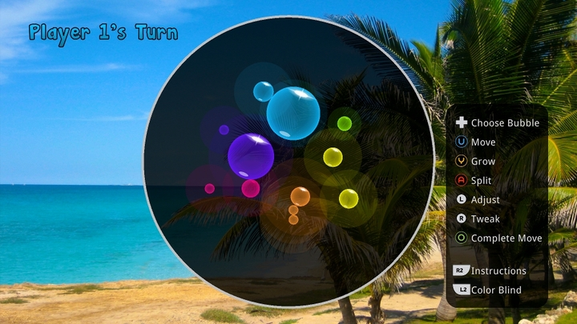

# Bubbliminate
A fully-featured, AI-powered, turn-based strategy game written in Java 6 and [libgdx](https://libgdx.badlogicgames.com/). It was published for [OUYA](https://en.wikipedia.org/wiki/Ouya) in 2013, then for Android in 2014.

(Watch the video by clicking the image below.)

(It is currently unavailable in the Google Play store because it needs to be rebuilt with a newer API and resubmitted.)
 
This codebase includes all core code and also the code needed to run on a desktop OS. You can simply import the root folder into IntelliJ IDEA, then run CirclesDesktop as the main class.

Play against the computer opponents a bit, then check out `class BestReplySearch`  where all the AI goodness starts!

## A History Slide Show - Hooray!
The game mechanics were designed in 2000 under the name "Protozoa", prototyped in no less than QBasic for DOS.

Moves were typed in using polar coordinates. (Not true of the modern version. You're welcome.)

A decade later, a more usable version was made for Windows using Java and Eclipse RCP, though still no AI.

Three years later, thirteen years after conception, the game was finally published!

...raking in a record-setting $70, which equates to something mighty less than $1/hr. And do I regret building it? Of course not!
